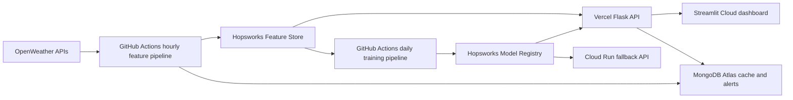

# Pearls AQI Predictor

Serverless AQI forecasting system for Karachi, Pakistan. The project collects OpenWeather pollutant and weather data, engineers hourly features, stores reusable data in Hopsworks Feature Store, trains multiple models, registers the selected model in Hopsworks Model Registry, and serves 72-hour AQI forecasts through Flask and Streamlit.

## Architecture



## Karachi Configuration

The default city is Karachi and is configured centrally:

```bash
AQI_CITY=Karachi
AQI_LAT=24.8607
AQI_LON=67.0011
AQI_TIMEZONE=Asia/Karachi
AQI_FORECAST_HOURS=72
AQI_MAX_FORECAST_HOURS=72
```

Internal timestamps are stored in UTC. API/dashboard display fields include Karachi-local timestamps such as `event_time_local`.

## Setup

```bash
python -m venv .venv
source .venv/bin/activate
python -m pip install --upgrade pip setuptools wheel
pip install -r requirements.txt
pip install -e .
cp .env.example .env
```

Optional TensorFlow experiment:

```bash
pip install -r requirements-ml.txt
```

Required environment variables:

```bash
OPENWEATHER_API_KEY=...
HOPSWORKS_API_KEY=...
HOPSWORKS_PROJECT=...
MONGODB_URI=...
MONGODB_DATABASE=pearls_aqi
AQI_CITY=Karachi
AQI_LAT=24.8607
AQI_LON=67.0011
AQI_TIMEZONE=Asia/Karachi
ALLOWED_ORIGINS=http://localhost:8501,https://your-dashboard-url.streamlit.app
```

`CITY_NAME`, `CITY_LAT`, `CITY_LON`, and `TIMEZONE` are accepted as aliases for deployment platforms that already use those names, but the documented production variables are the `AQI_*` names above.

Do not commit `.env`. It is intentionally ignored.

## Pipelines

Hourly feature ingestion:

```bash
python -m aqi_predictor.pipelines.feature_pipeline
```

Historical backfill:

```bash
python -m aqi_predictor.pipelines.backfill_pipeline --days 90
```

Backfill pulls historical air-pollution data from OpenWeather. Historical weather is reconstructed from the `karachi_weather_raw` feature group when cached hourly weather exists. If historical weather coverage is sparse because the OpenWeather plan does not provide historical weather, the training pipeline excludes high-missingness weather columns instead of silently training on mostly empty features.

Daily training and model registration:

```bash
python -m aqi_predictor.pipelines.training_pipeline --no-sample-if-empty
```

Training reads `karachi_aqi_features`, uses a time-aware split, evaluates baselines, Ridge, Random Forest, HistGradientBoosting, and a TensorFlow dense experiment when TensorFlow is installed. The lowest-RMSE candidate is selected. If TensorFlow wins, the registry metadata marks the Keras model and scaler as the serving artifacts; otherwise the selected Scikit-learn artifact is served. For the selected Scikit-learn model, training also writes precomputed SHAP explainability artifacts under `reports/` and model metadata so Streamlit can display explanations without recomputing SHAP on every page load.

Batch prediction:

```bash
python -m aqi_predictor.pipelines.predict_pipeline --horizon 72
```

## Model Serving

Flask and Streamlit use a registry-first loader:

1. Try to download the latest approved Hopsworks model version, or latest available version.
2. Validate `metadata.json`, model type, feature schema, and estimator feature count.
3. Load only trusted internal `model.joblib` files, or registered TensorFlow `model.keras` plus scaler artifacts, from controlled model directories.
4. Fall back to local `models/latest` only when `AQI_ALLOW_LOCAL_MODEL_FALLBACK=true`.

For production serving, use:

```bash
AQI_ALLOW_LOCAL_MODEL_FALLBACK=false
AQI_REQUIRE_HOPSWORKS_MODEL_REGISTRY=true
```

The `/model-info` route and dashboard show model source, registry version, training timestamp, metrics, feature count, and latest feature timestamp. The dashboard also separates the latest observed Karachi AQI from the next-hour forecast.

## Run Locally

Offline demo with deterministic sample data:

```bash
python -m aqi_predictor.pipelines.backfill_pipeline --days 60 --sample
python -m aqi_predictor.pipelines.training_pipeline
python -m aqi_predictor.pipelines.predict_pipeline --horizon 72 --sample
```

Start the Flask API:

```bash
python app/flask_api.py
```

Start the Streamlit dashboard:

```bash
streamlit run app/streamlit_app.py
```

Sample mode is for offline testing only. Live mode requires `OPENWEATHER_API_KEY`.

## API

- `GET /health`
- `GET /diagnostics`
- `GET /latest`
- `GET /predict?horizon=72`
- `GET /alerts?limit=20`
- `GET /model-info`

Validation:

- `horizon` must be an integer and is clamped to `1..72`.
- `limit` must be an integer and is clamped to `1..500`.
- API errors returned to clients are generic; detailed exceptions are logged server-side.
- CORS is controlled by `ALLOWED_ORIGINS`; wildcard CORS is not used.
- `/diagnostics` reports dependency and env-var presence only. It never returns secret values.

## Automation

GitHub Actions:

- `.github/workflows/hourly-feature-pipeline.yml`: hourly feature ingestion. GitHub scheduled workflows are best-effort and may drift, so this is configured hourly but not guaranteed to execute at the exact minute every hour.
- `.github/workflows/daily-training-pipeline.yml`: daily training with TensorFlow dependencies and required Hopsworks registration.
- `.github/workflows/ci.yml`: pytest on push and pull request.
- `.github/workflows/deploy-cloud-run.yml`: manual Cloud Run deployment for the Flask API.

Dashboard deployment target: Streamlit Community Cloud. Set `API_BASE_URL=https://aqi-predictor-10-pearls.vercel.app` if the dashboard should call the Flask API; omit it to use the shared service code directly from Streamlit.

Primary API deployment target: Vercel using `api/index.py`, `vercel.json`, and the lightweight `pyproject.toml` runtime dependencies. Cloud Run using the included `Dockerfile` remains the fallback if Vercel hits dependency size, timeout, memory, or TensorFlow-serving limits.

The `.streamlit/config.toml` file provides Streamlit Cloud defaults for theme, headless mode, CORS, XSRF protection, and disabled usage telemetry.

See [docs/deployment.md](docs/deployment.md) for serverless deployment steps and required secrets.

## Feature Groups

- `karachi_air_quality_raw`
- `karachi_weather_raw`
- `karachi_aqi_features`
- `karachi_aqi_predictions`

## EDA and Reports

```bash
PYTHONPATH=src python scripts/generate_eda_report.py
```

Reports:

- `reports/eda_report.md`
- `reports/model_metrics.json`
- `reports/project_report.md`
- `reports/shap_summary.json`
- `reports/feature_importance.json`
- `notebooks/karachi_aqi_eda.ipynb`

## Tests

```bash
pytest
```

The tests cover feature engineering, AQI boundaries, Karachi timezone conversion, model loading fallback/schema validation, TensorFlow candidate selection, API validation/CORS, OpenWeather retry behavior, backfill dedupe/continuity, and end-to-end sample forecasting.

Lint:

```bash
ruff check src app tests scripts
```

## Known Limitations

- AQI score is derived from OpenWeather pollutant concentrations using EPA-style breakpoints. It is not an independent government station AQI reading.
- OpenWeather historical air-pollution data is supported; historical weather availability depends on plan/API access. Sparse historical weather is handled by excluding high-missingness weather features from training.
- TensorFlow is eligible for selection and serving when installed, but current production metrics still favor Ridge Regression.
